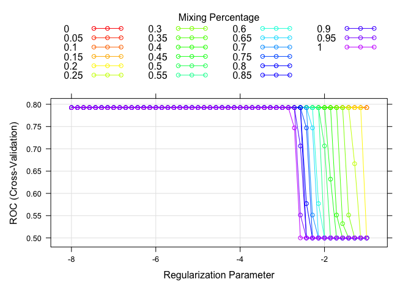

Chhiring_Analysis.Rmd
================
Chhiring Lama
2026-02-03

Objective: The primary goal of this trial is to compare the safety
profiles of Pill A, GelB and GelC, i.e. whether the medications are sage
for patients

\###import and clean data

    ## quartz_off_screen 
    ##                 2

Patient Distribution: 30 people in per treatment sequence Initial
Observation: Most patients do not face adverse events over the course of
4 weeks in each of the consecutive periods.

## add demographic data

### Logistic Regression

\##Penalized Logistic Regression

    ##    alpha    lambda
    ## 50     0 0.3678794

<!-- -->

    ## 7 x 1 sparse Matrix of class "dgCMatrix"
    ##             s=0.3678794
    ## (Intercept)  -3.2241228
    ## period        .        
    ## treatment     .        
    ## carryover     .        
    ## age           0.0215778
    ## gender        .        
    ## race          .

\##Performance

    ## 
    ## Call:
    ## summary.resamples(object = res)
    ## 
    ## Models: GLM, GLMNET 
    ## Number of resamples: 10 
    ## 
    ## ROC 
    ##             Min.   1st Qu.    Median      Mean   3rd Qu.      Max. NA's
    ## GLM    0.5614035 0.7214912 0.7511854 0.7531057 0.7820057 0.9279279    0
    ## GLMNET 0.6315789 0.7094595 0.7741228 0.7925202 0.8860538 0.9549550    0
    ## 
    ## Sens 
    ##            Min. 1st Qu. Median      Mean 3rd Qu. Max. NA's
    ## GLM    0.972973       1      1 0.9972973       1    1    0
    ## GLMNET 1.000000       1      1 1.0000000       1    1    0
    ## 
    ## Spec 
    ##        Min. 1st Qu. Median Mean 3rd Qu. Max. NA's
    ## GLM       0       0      0    0       0    0    0
    ## GLMNET    0       0      0    0       0    0    0

    ## quartz_off_screen 
    ##                 2

    ## quartz_off_screen 
    ##                 2
